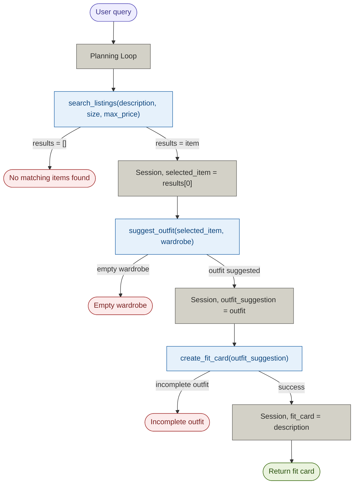

# FitFindr — planning.md

> Complete this document before writing any implementation code.
> Your spec and agent diagram are what you'll use to direct AI tools (Claude, Copilot, etc.) to generate your implementation — the more specific they are, the more useful the generated code will be.
> Your planning.md will be reviewed as part of your submission.
> Update it before starting any stretch features.

---

## Tools

List every tool your agent will use. For each tool, fill in all four fields.
You must have at least 3 tools. The three required tools are listed — add any additional tools below them.

### Tool 1: search_listings

**What it does:**
<!-- Describe what this tool does in 1–2 sentences -->
Searches the listing database (listing.json) for items that match the user query. 

**Input parameters:**
<!-- List each parameter, its type, and what it represents -->
- `description` (str): Description of the item including its category such as top or bottom, the style or aesthetic, color, condition, or brand name
- `size` (str): the size of the clothing item such as S/M/L/XL or with specific number "US 7" 
- `max_price` (float): the max cost of the item

**What it returns:**
<!-- Describe the return value — what fields does a result contain? -->
Returns a maximum of 3 matching items from the listing that fit the description, size, and max_price constraints. 
Return value is a list of items (dict) and each item has fields id, title, description, category, style_tags, size, condition, price, colors, brand, platform.

**What happens if it fails or returns nothing:**
<!-- What should the agent do if no listings match? -->
If no listings match, the agent should return a clear message "No matching items found" and not call any other tools.

---

### Tool 2: suggest_outfit

**What it does:**
<!-- Describe what this tool does in 1–2 sentences -->
The tool recommends an outfit combination to the user with the new item it found in listings and with clothes in the wardrobe. The outfit should be complete with at minimum a top, bottom, and shoes. 

**Input parameters:**
<!-- List each parameter, its type, and what it represents -->
- `new_item` (dict): the new listing suggested for the user based on Tool 1 search_listings
- `wardrobe` (dict): a collection of clothing items the user currently has 

**What it returns:**
<!-- Describe the return value -->
The tool returns one complete outfit with at least a top, bottom, and shoes. 
The outfit should be returned as a list of clothing items (dict). 
A description of the outfit and each piece of clothing used is returned. 

**What happens if it fails or returns nothing:**
<!-- What should the agent do if the wardrobe is empty or no outfit can be suggested? -->
If the wardrobe is empty the agent should return a "Empty wardrobe" message. If no outfit can be suggested the agent should return a "No outfit can be made" message. No other tools should be called.

--

### Tool 3: create_fit_card

**What it does:**
<!-- Describe what this tool does in 1–2 sentences -->
Generates a short, sharable description of a complete outfit

**Input parameters:**
<!-- List each parameter, its type, and what it represents -->
- `outfit` (list): a list of clothing items that make up a complete outfit

**What it returns:**
<!-- Describe the return value -->
A short description of the outfit that describes the aesthetic and style of the outfit.

**What happens if it fails or returns nothing:**
<!-- What should the agent do if the outfit data is incomplete? -->
The agent should return "Incomplete outfit" 

---

### Additional Tools (if any)

<!-- Copy the block above for any tools beyond the required three -->

---

## Planning Loop

**How does your agent decide which tool to call next?**
<!-- Describe the logic your planning loop uses. What does it look at? What conditions change its behavior? How does it know when it's done? -->

When the user asks for a clothing item, the agent should call search_listings with the description, size, and max_price if present in the user query. If no matching items are found, the agent should return the error message. The agent should not call any other tools. If a clothing item is returned the agent should call suggest_outfit and return an outfit along with a description of the outfit. If no outfit can be made, the agent should return the corresponding error message. The agent should not call any other tools. If an outfit is returned, the agent should move on to create_fit_card. The output of create_fit_card is returned. No other tools are called.

---

## State Management

**How does information from one tool get passed to the next?**
<!-- Describe how your agent stores and accesses state within a session. What data is tracked? How is it passed between tool calls? -->

search_listings() returns 3 items. The first item is selected (selected_item) and passed to suggest_outfit(). suggest_outfit() returns a list containing the outfit (outfit_suggestion) and that is passed to create_fit_card(). 
Finally, the fit_card description is returned to the user.  

---

## Error Handling

For each tool, describe the specific failure mode you're handling and what the agent does in response.

| Tool | Failure mode | Agent response |
|------|-------------|----------------|
| search_listings | No results match the query | Return "No matching items found" message|
| suggest_outfit | Wardrobe is empty |Return "Empty wardrobe" message |
| create_fit_card | Outfit input is missing or incomplete | Return "Incomplete outfit"  message|

---

## Architecture

<!-- Draw a diagram of your agent showing how the components connect:
     User input → Planning Loop → Tools (search_listings, suggest_outfit, create_fit_card)
                                                                          ↕
                                                                   State / Session
     Show what triggers each tool, how state flows between them, and where error paths branch off.
     ASCII art, a Mermaid diagram (https://mermaid.js.org/syntax/flowchart.html), or an embedded
     sketch are all fine. You'll share this diagram with an AI tool when asking it to implement
     the planning loop and each individual tool. -->

 

---

## AI Tool Plan

<!-- For each part of the implementation below, describe:
     - Which AI tool you plan to use (Claude, Copilot, ChatGPT, etc.)
     - What you'll give it as input (which sections of this planning.md, your agent diagram)
     - What you expect it to produce
     - How you'll verify the output matches your spec before moving on

     "I'll use AI to help me code" is not a plan.
     "I'll give Claude my Tool 1 spec (inputs, return value, failure mode) and ask it to implement
     search_listings() using load_listings() from the data loader — then test it against 3 queries
     before trusting it" is a plan. -->

**Milestone 3 — Individual tool implementations:**
AI tool: Claude
Inputs: planning.md (specific tool sections, planning loop, error handling), architecture diagram
Expected output: using load_listings() implement search_listings(), suggest_outfit(), and create_fit_card() in tools.py
Validation: Write pytest tests for each tool in a tests/ folder. Test each tool's implementation and error handling with example query.

**Milestone 4 — Planning loop and state management:**
AI tool: Claude
Inputs: planning.md (planning loop, state management, error handling), architecture diagram
Expected output: implement run_agent() in agent.py and handle_query() in app.py
Validation: Verify state is passing correctly through agent loop. Verify that agent does not call additional tools in after error. Verify the entire process runs from query to result and output is as expected.

---

## A Complete Interaction (Step by Step)

Write out what a full user interaction looks like from start to finish — tool call by tool call. Use a specific example query.

**Example user query:** "I'm looking for a vintage graphic tee under $30. I mostly wear baggy jeans and chunky sneakers. What's out there and how would I style it?"

**Step 1:**
<!-- What does the agent do first? Which tool is called? With what input? -->
The agent searches for vintage graphic tees under $30 by callingthe search_listings tool. Specifically looking for the category "tops", style tags "vintage" and "graphic tee", and a price less than 30. The tool returns 3 matching listings and FitFindr picks the top result.

**Step 2:**
<!-- What happens next? What was returned from step 1? What tool is called now? -->
 The listing for the graphic tee is returned from step 1 (top result) and then the agent uses the suggest_outfit tool with the new item and the users wadrobe to recommend an outfit pairing. 

**Step 3:**
<!-- Continue until the full interaction is complete -->
Agent uses create_fit_card to generate a short description of the outift.

**Final output to user:**
<!-- What does the user actually see at the end? -->
The user sees the recommended item, a detailed description on how to create the outfit, and a final short summary of the outfit. 